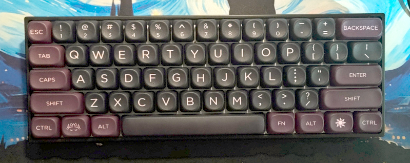
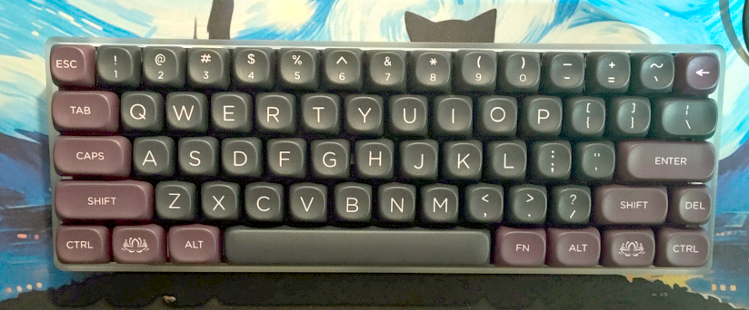
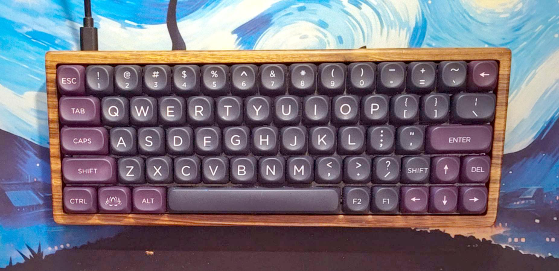

# 60% Evolution

**Base 61 key layout**

The most common.

**Split backspace and split right shift**

Adds a spot for the grave/tilde key and an extra that can be used for FN or DEL.

**"Minila" layout**

Shift the "Z" row 1/4 of a key space left to make room for an arrow cluster in the lower right.
