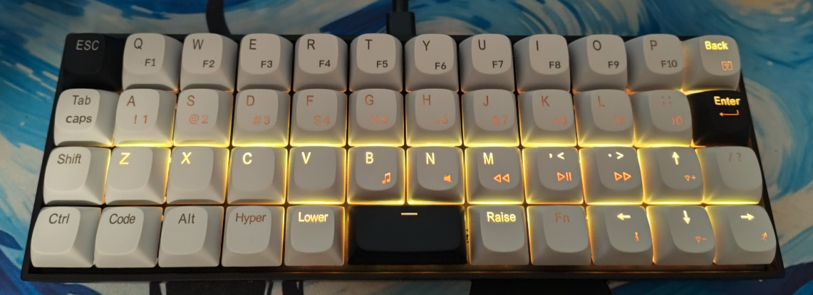
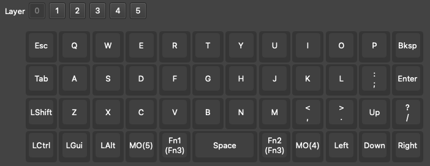
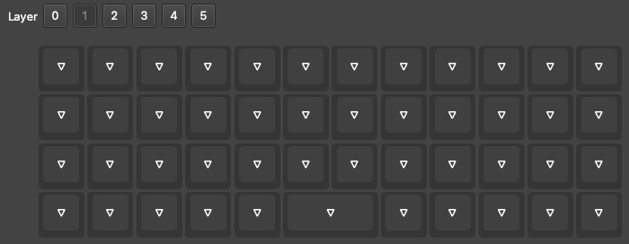
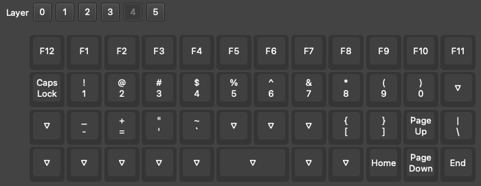

# Improved VIAL layout with "hyperscape" backlight color display

Hyper-space mode:

### Holding the Fn key illuminates the keys with a "Function" keycode.

### Holding the Hyper key illuminates the keys with a "Hyper" keycode.

## How it works:

Find the code here:

* https://github.com/ArgentStonecutter/vial-qmk/tree/inland-mk47-colors/keyboards/inland/mk47

keymap "vialstock" matches the stock MK47 VIA configurations, except that Fn-Space turns on the function hilights.

keymap "vial":

layer 0 - default layer 
 
Bottom row has been changed to match the provided keycaps. 
`Hyper` is layer 5 (media and backlight), 
`Fn` is layer 4 (alternate keycodes), 
`Lower`/`Raise` provide access to layers 1-3 for user use.

layer 1, 2, 3 - blank 
 
Unused in the default layout, all identical.

layer 4 - Fn - alternate keycodes 
 
Function-arrows get you the navigation keys. 
The existing `<>?` keys map to the second row bracket/backslash. 
The remaining keys are mapped over `ZXCV`

layer 5 - Hyper - media and backlight 
 
`Hyper` exposes the displayed media controls, 
`ZXCV` get the remaining backlight functions. 
`Hyper`-`Lower` and -`Raise` are the volume controls, 
`Hyper`-`Space` turns on the function backlights.
